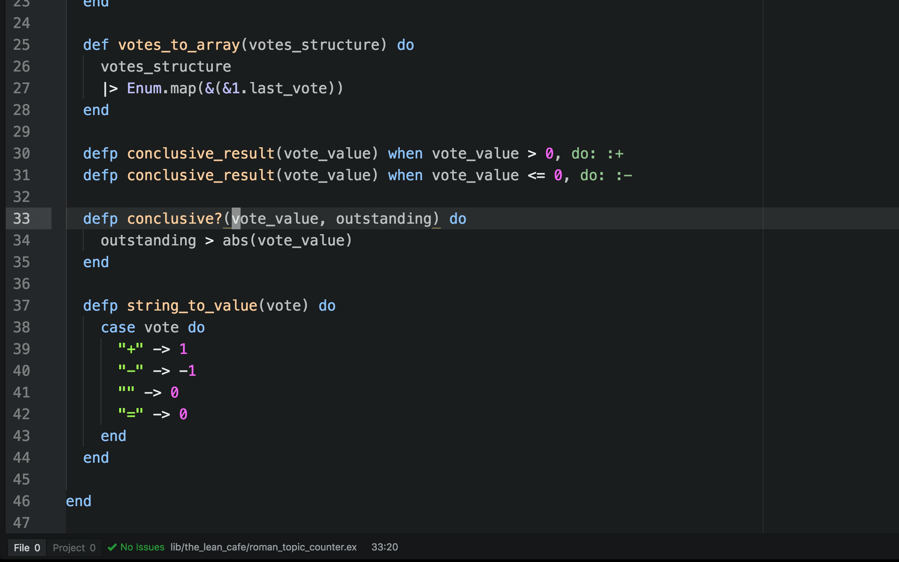
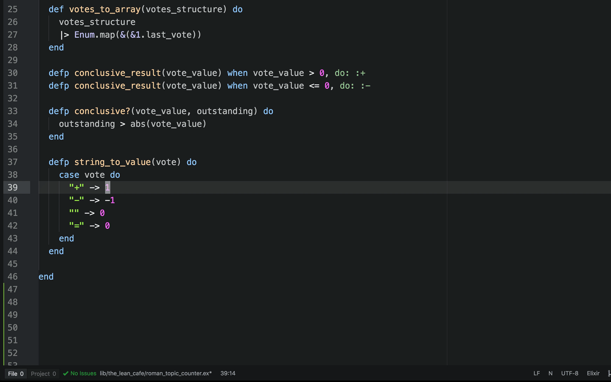

# vim-mode-plus-exchange package

A port of Tom McDonald's [vim-exchange](https://github.com/tommcdo/vim-exchange).

Notice that the `.` command can be used to mark a second area for the exchange using the same {motion} as the first.

`cxx` marks a line to be exchanged. In visual-mode, `x` marks the selection to be exchanged.

`cxc` clears pending exchanges.

See these pages for more:
* [Swapping two regions of text with exchange.vim][e65]
* [vim-exchange](https://github.com/tommcdo/vim-exchange)

[e65]: http://vimcasts.org/episodes/swapping-two-regions-of-text-with-exchange-vim
